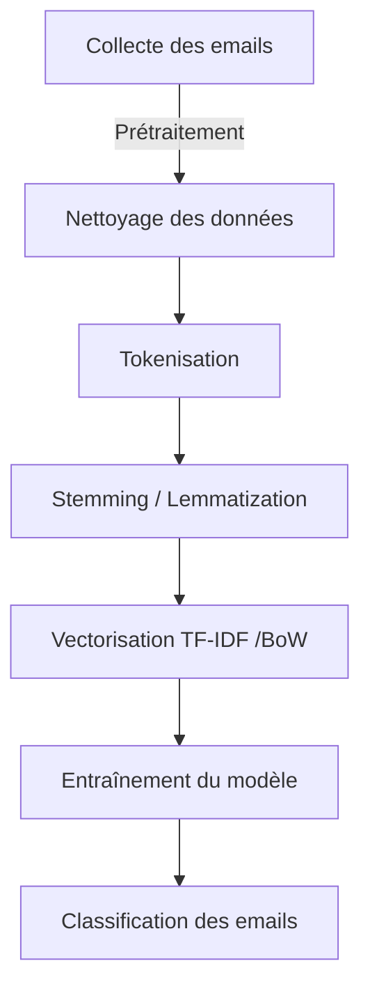

Cet article traite de la création d’un modèle d’intelligence artificielle qui permettra de différencier les emails en deux catégories: spam et non spam. Le modèle sera basé sur **Naive Bayes** et on utilisera des données provenant de **SpamAssassin**. Le but de cet article est de comprendre comment fonctionne un modèle d’IA en l’appliquant à un besoin spécifique.

On commencera par collecter puis nettoyer les données (emails provenant de SpamAssassin), et ensuite vectoriser ces données (les transformer en une forme numérique compréhensible par l’IA) puis ensuite les entraîner afin d’évaluer le modèle.

Le diagramme suivant illustre le flux des données depuis la source jusqu’à l’étape finale de classification:



# Collecte des données

Pour commencer, on veut récupérer des emails, qu'on va pouvoir charger dans le modèle afin de le préparer pour la classification. Ces données seront chargées à partir de datasets publics au choix. Un dataset ou encore jeu de données public est un ensemble de données qui est libre d’accès, et qui peut être utilisé par tous. Les datasets publics sont souvent utilisés pour entraîner des modèles d’intelligence artificielle.

Pour cela, on peut chosir parmi plusieurs sources de données suivantes:

* [SpamAssasin](https://spamassassin.apache.org/) : un projet open source anti-spam qui offre la possibilité d’identifer, flitrer et bloquer des courriels indésirables. Il utilise des analyses heuristiques sur les en-têtes et les corps des courriels pour l’analyse.
    
* [Enron Email Dataset](https://www.cs.cmu.edu/~./enron/) : une base de données de milliers de courriels provenant des employés de l’entreprise Enron.
    

# Prétraitement des données

### Nettoyage

Plusieurs éléments des emails qui ne seront pas utiles lors de la classification seront supprimés. Il s’agit par exemple des en-têtes **(“From: “ , “To: “)** indiquant l’expéditeur et le récepteur, des liens et URLs ou encore des pièces jointes. On se concentre juste sur le contenu du courriel et aussi les éléments de l’en-tête comme l’adrresse de l’expéditeur qui peuvent être utiles pour détecter des modèles de spam. Par la suite, le texte entier du courriel sera converti en minuscules car pour plusieurs modèles de machine learning, les mots “bonjour“ et “Bonjour“, sont deux mots différents. Les stopwords sont aussi supprimés vu qu’ils n’influent pas directement sur la classification de l’email en fonction de son contenu.

Il existe plusieurs manières permettant de nettoyer le courriel, dépendemment de la facon dont on veut que le modèle fonctionne. On pourrait par exemple supprimer les liens ou les URLs ou les garder. Ces liens peuvent parfois êtres des indicateurs de spam assez flagrants; comme le domaine ou des liens suspects.

```python
import re 


# Fonction pour nettoyer le texte
def clean_email(emails_to_clean):

    # Si un seul email est fourni sous forme de chaîne, on le convertit en liste
    if isinstance(emails_to_clean, str):
        emails_to_clean = [emails_to_clean]

    cleaned_emails = []

    for email in emails_to_clean:
        #Convertir en minuscules
        email = email.lower()

        #Supprimer les sauts de ligne
        email = email.replace("\n", " ")

        #Supprimer les en-têtes des emails (on garde juste le contenu)
        #Le ^\s*, permet de supprimer les termes juste au début de la ligne, et si ils sont suivis de ":" 
        #Si les termes sont ailleurs dans le texte, ils ne sont pas supprimés
        email = re.sub(r"(?i)\b(subject|from|to|de|à|sujet)\b\s*:\s*",
                       "",
                       email)

        cleaned_emails.append(email)

    print(cleaned_emails)
    return cleaned_emails

# Exemple d'utilisation
email_text = """
De: Expéditeur
À: Recepteur
Subject: Réunion à 11h 

bonsoir à tous,
On fait un exemple pour tester le nettoyage. Vous pouvez consulter l'article à l'adresse https://blog.fikara.io
Cordialement,
"""
cleaned_text = clean_email(email_text)
```

En exécutant le code avec l’exemple ci-dessus, on obtient le résultat suivant:


On voit bien que le courriel a été nettoyé. Le texte d’abord converti en minuscule, et ensuite les termes de l’entête du message ont été supprimés ("De", "À", "Subject"). Ici, on a gardé les stopwords.

### Tokenization

La tokenization est un processus qui consiste à découper du texte en de plus petites unités commes des mots, des phrases, des caractères etc. Elle transforme du texte brut, comme une série de plusieurs phrases, en de mots beaucoup plus courts. Cette étape est nécessaire avant d’entraîner le modèle d’IA, vu qu’il ne comprend pas directement les mots.

Il existe plusieurs types de tokenization:

* **La tokenization par mots** : elle consite à découper du texte par des mots simples. Par exemple, la phrase **“Mes cheveux sont longs !“** devient **\[“Mes“, “cheveux”, “sont”, “longs”, “!”\]**
    
* **La tokenization par caractères**: ici, chaque caractère d’un mot est traité individuellemment. Par exemple, **\[“bonjour“\]** devient **\[“b”, “o”, “n”, “j”, “o”, “u”, “r”\]**
    
* **La tokenization basée sur des règles spécifiques (regex tokenization)**: elle utilise des expressions régulières pour découper le texte et extraire les mots selon des motifs définis. Elle permet d’extraire par exemple des emails, des URLs, des numéros de téléphone etc.
    

Dans notre cas, on applique la tokenization des mots.

```python
import re
import nltk
from nltk.tokenize import word_tokenize

#Télécharger les ressources pour la tokenization
nltk.download('punkt')

# Fonction pour tokenizer le texte
def tokenize_email(text):
    cleaned_text_list = clean_email(text) # On utilise d'abord la fonction pour nettoyer le texte
    tokens_words= []    

    for email in cleaned_text_list :
        words = word_tokenize(email)
        tokens_words.append(words)
    print("Tokens après tokenization: ",tokens_word)
    return tokens_words

# Exemple
email_text = "On fait un essai avec cet exemple."
tokenize_email(email_text)
```

On obtient le résultat suivant:


On voit que le texte a bien été traité. Le script a retourné la liste de tokens de la fonction.

### Stemming (racinisation) et Lemmatization

Ces deux techniques aident à ramener les mots dérivés d’un autre mot à leur forme de base, pour éviter d'avoir plusieurs versions d'un même mot.

* **Stemming**: elle consiste à réduire un mot à sa racine (d’où le terme racinisation) sans pour autant produire des mots qui seront valides. Par exemple, les mots "chanter", "chante", "chantait” peuvent être réduits à la racine "chant".
    
* **Lemmatization**: elle consiste à ramener un mot à sa forme de base, ce qui donne un mot valide. Par exemple les mots "étudiants", "étudier", et "étudié" qui seraient tous ramenés au mot "étudier".
    

Dans notre cas, c’est la **lemmatization** qui sera choisi car on veut garder le sens des mots.

```python
import spacy # Importation de la bibliothèque spaCy pour la lemmatization en anglais et en francais
import nltk
from nltk.tokenize import word_tokenize 

# charger le modèle francais de spaCy
nlp = spacy.load("fr_core_news_sm") 

def lemmatize_email(text):
    tokens_list = tokenize_email(text) #Récupérer les mots sur lesquels on applique la lemmatization 
    lemmatize_list = []
    
    for token in tokens_list:
        # Lemmatization
        doc = nlp(" ".join(tokens))  #transformer les tokens en un document SpaCy
        lemmatized_tokens = [token.lemma_ for token in doc]
        lemmatize_list .append(lemmatized_tokens)

    print("Tokens après lemmatization: ",lemmatize_list)
    return lemmatize_list 

# Exemple d'utilisation
text = "Les étudiants n'aiment pas l'examen, mais ils doivent l'étudier."
lemmatize_email(text)
```

L’utilisation de spaCy nécessite l’exécution des commandes suivantes:

```plaintext
pip install spacy
python -m spacy download fr_core_news_sm
```

On obtient le résultat suivant:


On peut voir que la lemmatization a fonctionné:

* “étudiants“ devient “étudiant“
    
* “doivent“ devient “devoir“
    
* “n’aiment“ devient “ne aimer“ et “l’étudier“ devient “le étudier“
    
    * spaCy sépare le “n“ en “ne“
        
    * il sépare aussi “l“ et “étudier“
        
    * “l’ “ et “n’ “ sont ensuite lemmatisés à leur forme originale “le“ et “ne“
        
* “les“ est aussi lemmatisé en “le“, ce qui est normal en francais
    

### **Vectorisation**

La vectorisation est la prochaine étape. Elle consiste à transformer les mots ou les phrases obtenues des étapes précédentes en une représentation numérique qui sera comprise par les modèles d’IA, car ceux-ci ne peuvent pas directement comprendre du texte brut.

Il existe plusieurs méthodes de vectorisation de texte:

* **Bag of Words (BoW)** : elle consiste à compter le nombre d’occurence d’un mot dans le texte au complet. Chaque mot est donc associé à une valeur numérique qui représente le nombre de fois où il apparaît dans le texte. Chaque phrase devient un vecteur basé sur la fréquence de ces mots.
    
    Prenons l’exemple des deux phrases suivantes: “Je mange du pain“ et “Le pain du boulanger“. Un vocabulaire est d’abord crée pour tous les mots dans les deux phrases.
    
    **Vocabulaire** : \[“Je“, “mange“, “du“, “pain“, “Le“, “boulanger“\]
    
    **Vecteur 1** : \[1, 1, 1, 1, 0, 0\]
    
    **Vecteur 2** : \[0, 0, 1, 1, 1, 1\]
    
* **TF-IDF (Term Frequency - Inverse Document Frequency)**: elle consiste à déterminer l’importance d’un mot dans un document en fonction de sa fréquence dans le texte et de sa rareté dans l’ensemble du corpus . Elle combine deux mesures:
    
    * **Term Frequency (TF)** est la fréquence d’un mot dans un texte. Donc plus un mot est comptabilisé dans un texte, plus sa valeur TF est élevée.
        
    * **Inverse Document Frequency (IDF)** évalue l’importance d’un mot dans le corpus en tenant compte de sa rareté dans celui ci. Donc, moins un mot apparaît, plus sa valeur IDF est élevée.
        

Dans le cas de notre exercice pour le modèle qui détecte les spams, il est donc plus efficace d’utiliser **TF-IDF**.

```python
from sklearn.feature_extraction.text import TfidfVectorizer #Importer la bibliothèque

def vectorize_email(text):
    # Récupérer les tokens après lemmatisation
    lemmatized_tokens_list = lemmatize_email(text)

    # Transformer la liste de tokens en phrases séparées
    emails = [" ".join(email) for email in lemmatized_tokens_list]

    print("Texte à vectoriser :", emails)

    # Initialiser le vectorizer TF-IDF
    vectorizer = TfidfVectorizer()
    #vectorizer = TfidfVectorizer(stop_words='english')


    #On applique la vectorization ici sur la liste de phrases
    tf_idf = vectorizer.fit_transform(emails)

    #On affiche les termes retenus par TF-IDF
    #Ces termes correspondent au tableau plus bas.
    print("Mots clés : ", vectorizer.get_feature_names_out())

    #On convertit la matrice en tableau plus lisible
    #Chaque ligne du tableau représente un document et chaque colonne représente un mot parmi ceux à vectorizer
    print("Matrice TF-IDF : \n", tf_idf.toarray())

    #Ici on vérifie les mots qui auraient été supprimés lors du processus de vectorisation TF-IDF
    tokens_set = set(word for email in lemmatized_tokens_list for word in email)  # Mots initiaux
    tf_idf_set = set(vectorizer.get_feature_names_out())
    mots_supprimes = tokens_set - tf_idf_set
    print("Mots supprimés :", mots_supprimes)

    return tf_idf


# Exemple d'utilisation
text = [ "Les étudiants n'aiment pas l'examen, mais ils doivent l'étudier. ",
 "L'examen final est prévu pour lundi matin."]
vectorize_email(text)
```

On obtient le résultat suivant:


On voit que le TF-IDF a extrait les mots du document à vectorizer et chaque mot apparaît juste une fois dans la liste des mots clés. Chaque ligne de la matrice correspond à une phrase (matrice \[\] ). Le vecteur TF-IDF contient une matrice par texte; ce qui sera pratique dans notre cas car on voudrait séparer et vectoriser chaque email.

# **Entraînement et évaluation du modèle**

Après que les e-mails aient été transformés en vecteurs numériques, ils sont préparés à être analysés par le modèle. Les vecteurs TF-IDF obtenus précédemment servent maintenant à apprendre au modèle à distinguer spam et non-spam. Il faut maintenant choisir un modèle adapté à notre exercice. Pour cela on peut utiliser un des modèles suivants:

* **Naive Bayes**: c’est un algorithme de classification de texte. Il utilise des probabilités pour classer les textes, en supposant que les mots sont indépendants.
    
* **Logistic Regression:** c’est une méthode de classification binaire qui prédit la probabilité qu’une instance appartienne à une classe donnée.
    

Avec les scores TF-IDF obtenus, on pourra entraîner le modèle choisi.

Ici, nous utiliserons **Naive Bayes**, car il est plus efficace pour les situations de classification de texte courts et aussi avec une petite base de données.

```python
from sklearn.naive_bayes import MultinomialNB  # Import modèle Naïve Bayes
from sklearn.model_selection import train_test_split  # Pour diviser les données en train/test
from sklearn.metrics import accuracy_score, precision_score, recall_score, f1_score #Importer les fontios d'évaluation
import numpy as np

def eval_model(X,y):

    X_train, X_test, y_train, y_test = train_test_split(X, y, test_size=0.3, random_state=42)

    # Initialiser le classificateur Naive Bayes
    model = MultinomialNB()

    # Entraîner le modèle
    model.fit(X_train, y_train)

    # Prédire sur l'ensemble de test
    y_pred = model.predict(X_test)

    # Évaluer le modèle
    accuracy = accuracy_score(y_test, y_pred)
    precision = precision_score(y_test, y_pred, pos_label=1)
    recall = recall_score(y_test, y_pred, pos_label=1)
    f1 = f1_score(y_test, y_pred, pos_label=1)

    print(f"Accuracy: {accuracy:.2f}")
    print(f"Precision: {precision:.2f}")
    print(f"Recall: {recall:.2f}")
    print(f"F1 Score: {f1:.2f}")

    return model


email_texts = [
    "Bonjour, veuillez confirmer votre compte en cliquant ici.",  # Non-spam
    "Gagnez 10 000 $ maintenant ! Cliquez ici pour en profiter.",  # Spam
    "Votre rendez-vous est confirmé pour demain.",  # Non-spam
    "Achetez maintenant, offre exclusive à durée limitée !",  # Spam
    "Votre facture est disponible, veuillez vérifier.",  # Non-spam
    "Offre spéciale ! Achetez deux et obtenez-en un gratuit.",  # Spam
    "Votre mot de passe a été modifié avec succès.",  # Non-spam
    "Cliquez ici pour obtenir une remise immédiate !",  # Spam
    "La réunion est prévue pour jeudi prochain.",  # Non-spam
    "Investissez maintenant et doublez vos gains !"  # Spam
]

# Étiquettes associées : 0 pour non-spam, 1 pour spam
y = [0, 1, 0, 1, 0, 1, 0, 1, 0, 1]

#Vecteurs TF-IDF des e-mails.
X = vectorize_email(email_texts)

# Appel de la fonction pour évaluer le modèle
model = eval_model(X, y)
```

### **Explication du** **code**

Ce code permettra d’entraîner le modèle Naive Bayes pour classifier les courriels en spam et non-spam, et ainsi évaluer ses performances. On utilise lesdonnées afin d’entraîner le modèle choisi. Vu qu’on souhaite détecter les courriels qui sont des spam de ceux qui ne le sont pas, il faut donc lui apprendre les caractéristiques des emails classés comme spam ou non.

* `X` contient les vecteurs TF-IDF des courriels, qui est obtenu après la vectorisation. Le texte est transformé en valeurs numériques à l’aide de TF-IDF pour que le modèle puisse l’analyser.
    
* `y` est la liste des étiquettes (labels) associées aux e-mails
    
* `X_train` représente les emails transformés en vecteurs avec la technique de vectorisation TF-IDF
    
* `y_train` représente les étiquettes, 1 pour spam et 0 pour non-spam, pour chaque instance de `X_train`
    
* `test_size=0.`3 signifie que 30% des données seront utilisés pour le test et le 70% restant pour l’entraînement
    
* la fonction `model.predict` sert à prédire les étiquettes des courriels dans la variable X\_test
    
* `y_pred` est la liste des prédictions effectuées par le modèle.
    

Voici un détail des fonctions d’évaluation:

* `accuracy_score` permet de calculer la précision globale du modèle ( le nombre d'exemples correctement classifiés sur le nombre total d’exemples)
    
* `precision_score` permet de mesurer la précision pour la classe positive c’est-à-dire parmi les emails prédits comme spams, ceux qui l’étaient réellement. C’est le rapport entre les vrais positifs et la somme des vrais positifs (TP True Positives) et des faux positifs (FP False Positives) TP + FP.
    
* `recall_score` mesure le pourcentage de positifs prédits par le modèle. Il indique parmi tout les courriels qui sont réellement du spam, combien ont été correctement détectés.
    
* `f1_score` calcule la moyenne harmonique entre la précision (precision) et le rappel (recall). C’est une métrique qui permet de donner une évaluation sur la performance du modèle. Un F1 score de 1 indique une parfaite précision et rappel, alors qu'un score de 0 indique que le modèle a échoué à prédire les résultats attendus.
    

On obtient le résultat suivant:


* `Accuracy: 0.67` signifie que 67 % des e-mails ont été correctement classés comme spam ou non-spam. Donc, sur 10 e-mails, 6-7 sont correctement classés.
    
* `Precison: 1.00` signifie que 100 % des e-mails marqués comme spam sont vraiment des spams.
    
* `Recall: 0.50` signifie que le modèle n'a détecté que 50 % des vrais spams. Donc la moitié des spams ont été oubliés (faux négatifs).
    
* `F1 Score 0.67` est le score globlal. Donc on peut dire que le modèle a une performance acceptable.
    

# Test

Pour l’étape de test, on récupère les données de SpamAssassin. Les fichiers d’emails récupérés puis sont étiquetés sous forme de dossiers:

* `spam` : emails indésirables
    
* `ham` : emails non spam
    

On télécharge les emails sur le site officiel de [SpamAssassin](https://spamassassin.apache.org/old/publiccorpus/) , et ensuite les décompresser avec des outils comme 7zip.

Il faut maintenant tester le modèle. On veut donc lui donner des e-mails et voir comment il réagit.

**Exemple de spams**


**Exemple de ham**


On obtient le résultat suivant:


* `Accuracy: 0.67` : 67% des emails sont bien classifiés.
    
* `Precision: 0.60` : 60% des emails prédits comme spam sont réellement des spams.
    
* `Recall: 1.00` : Le modèle détecte tous les spams correctement (aucun spam manqué).
    
* `F1 Score: 0.75`
    

# Conclusion

Dans ce projet, nous avons utilisé un modèle Naive Bayes pour classifier les e-mails en spam et non-spam. Après avoir vectorisé les e-mails avec la technique TF-IDF, le modèle a été entraîné sur des données annotées pour apprendre à reconnaître les spams. Grâce à l’apprentissage automatique, le modèle peut ensuite prédire automatiquement si de nouveaux e-mails sont des spams. N’hésitez pas à partager vos avis :)

# Source

* [Qu'est-ce qu](https://www.databricks.com/fr/glossary/what-is-dataset#:~:text=Les%20datasets%20publics%20regroupent%20des,gratuits%20et%20faciles%20%C3%A0%20t%C3%A9l%C3%A9charger.)['un datas](http://model.fit/)[et ? | Databricks](https://www.databricks.com/fr/glossary/what-is-dataset#:~:text=Les%20datasets%20publics%20regroupent%20des,gratuits%20et%20faciles%20%C3%A0%20t%C3%A9l%C3%A9charger.)
    
* [Classifying data using the Multinomial Naive Bayes algorithm - IBM Developer](https://developer.ibm.com/tutorials/awb-classifying-data-multinomial-naive-bayes-algorithm/)
    
* [Rec](https://inside-machinelearning.com/recall-precision-f1-score/#Recall)[all, Prec](http://model.fit/)[ision, F1 Score - Explication Simple Métrique en ML](https://inside-machinelearning.com/recall-precision-f1-score/#Recall)
    
* [NLTK stop words - Python Tutorial](https://pythonspot.com/nltk-stop-words/)