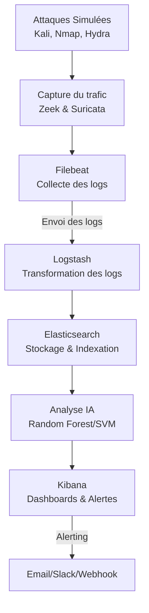

Ce présent article est sur la détection d’attaques en temps réel et combine du réseau, de la détection et de l’IA. Il permet de mettre en avant la gestion des logs avec ELK, l’analyse réseau avec Zeek et Suricata, le prétraitement avec l’IA puis la visualisation avec Kibana et Elasticsearch. L’article sera en deux parties: une première pour l’installation et la configuration de Zeek, Suricata puis ELK, puis une deuxième partie pour l’intégration de l’IA et la visualisation.

# Composants

* **Zeek**: système de détection d’intrusion IDS et d’analyse de trafic réseau. Il permet de générer des logs et fichiers détaillés sur les connexions et les activités observées.
    
* **Suricata**: IDS/IPS qui utilise des règles de détection pour inspecter le trafic et déclencher des alertes
    
* **ELK**: ensemble de trois outils
    
    * **Elasticsearch**: pour le stockage de logs, la recherche et l’analyse de ces logs.
        
    * **Logstash**: collecte des logs de Zeek et Suricata via Filebeat, transformation de ces logs en format JSON ou CSV puis envoi à Elasticsearch pour stockage.
        
    * **Kibana**: pour la visualtisation des données et création de dashboard
        
* **Filebeat**: pour la collecte des logs des deux IDS et l’envoi à Logstash
    
* **IA:** analyse des logs pour classer les évènements.
    

Voici un diagramme montrant l’architecture du projet et les différentes étapes.



# Étape 1: Préparation de l’environnement

La première étape consiste à configurer l’environnement de lab afin de simuler le réseau, capturer le trafic. On opte pour trois machines virtuelles:

* une machine Kali Linux qui sert d’attaquante.
    
* une machine vm1-ubuntu de 23G de disque, pour Zeek et Suricata
    
* une machine vm2-ubuntu de 23G de disque, pour ELK qui sera installé via Docker.
    

Les machines sont installées avec les configurations de bases. Pour le réseau, on choisit une configuration en mode `Bridge` afin d’avoir une réelle intégration réseau. Avant de poursuivre, il faut bien s’assurer que les machines sont bien connectées et arrivent à se pinger entre elles. Dépendemment du type de réseau que vous aurez choisi, des ajustements devront être faits.

La machine Kali ne nécessite pas d’installation supplémentaire. La plupart des outils comme nmap, hydra, metasploit sont déjà présents par défaut sur Kali.

## Installation de Zeek sur la vm1

Installer les dépendances pour Zeek:

```bash
sudo apt update 
sudo apt install build-essential cmake make gcc g++ flex bison libpcap-dev libssl-dev python3-dev zlib1g-dev swig
```

Télécharger [Zeek](https://zeek.org/get-zeek/) depuis le site officiel avec la commande suivante:

```bash
wget https://download.zeek.org/zeek-8.0.1.tar.gz
```

Extraire le fichier

```bash
 tar -xvzf zeek-8.0.1.tar.gz
```

Se déplacer dans le répertoire du fichier extrait puis configurer zeek avec la commande suivante:

```bash
cd zeek-8.0.1/
./configure
```

Il est possible que la commande montre des configurations incomplètes ou ne localisent pas toutes les librairies. Voici l’erreur que j’ai eue personnellement à cette commande.


On a d’abord la librairie ZeroMQ manquante, puis le cache à nettoyer. Pour résoudre cela, il faut installer la librairie avec la commande suivante:

```bash
sudo apt-get install libzmq3-dev
```


Puis vider le cache avec la commande

```bash
 make distclean
```


Sans ces deux réglages il ne serait pas possible de continuer. Une fois le problème résolu, il faut reconfigurer zeek avec la commande :

```plaintext
./configure
```

Compiler ensuite avec les commandes suivantes:

```bash
make
sudo make install
```

À noter que chacune de ces deux commandes peut prendre un bout de temps à s’exécuter.

Une fois que Zeek est configuré, il faut l’ajouter au PATH du système, afin de pouvoir lancer les commandes zeek depuis n’importe quel répertoire. Il faut donc ajouter le répertoire de zeek au fichier `.bashrc` ou `.zshrc`.

```bash
nano ~/.bashrc
```

Ajouter la ligne suivante en incluant le répertoire de zeek, <mark>à la fin du fichier</mark>. Ici, Zeek a été installé dans le répertoire `/usr/local/zeek`, les exécutables sont donc dans le répertoire `/usr/local/zeek/bin`.

```bash
export PATH="/usr/local/zeek/bin:$PATH"
```

Sauvegarder et quitter le fichier pour appliquer les changements avec la commande

```bash
source ~/.bashrc
```

Vous pouvez ensuite vérifier la version et l’emplacement de zeek et les logs avec la commande suivante:

```bash
zeek --version
which zeek
```


Lancer Zeek avec la commande suivante:

```bash
zeekctl deploy
```


Zeek est bien installé, mais l’utilisateur n’a pas les droits d’écrire dans le fichier `/usr/local/zeek/spool/`. Remplacer USER par le nom d’utilisateur

```bash
sudo chown -R [USER]:[USER] /usr/local/zeek/spool
sudo chown -R [USER]:[USER] /usr/local/zeek
```

En exécutant maintenat `zeekctl deploy`, on peut lancer zeek.


Zeek démarre mais on voit qu’il s’arrête automatiquement après.

On essaie de vérifier les logs générés dans le fichier `/usr/local/zeek/logs`.

```bash
ls  /usr/local/zeek/logs
```


On peut donc voir les premiers logs de sorties et d’erreurs de Zeek. Le fichier `stderr.log` capture les messages d’erreur générés puis le fichier `stdout.log` capture les messages de sortie de Zeek.

En essayant de lire le fichier de log `stderr.log`, il y a une petite erreur au niveau de l’interface `eth0`.


On voit que Zeek n’a pas les permissions pour analyser le trafic sur l’interface `eth0`. Il faut donc donner les droits de capture avec la commande suivante:

```bash
sudo setcap cap_net_raw,cap_net_admin=eip /usr/local/zeek/bin/zeek
```

En vérifiant aussi avec `ip a`, on voit que zeek essaie de démarrer sur l’interface `eth0`, alors que l’interface active sur la machine est l’interface `ens4`. Il faut donc modifier la configuration de zeek afin qu’elle démarre sur la bonne interface


Pour cela, exécutez les commandes suivantes

```bash
sudo nano /usr/local/zeek/etc/node.cfg
```

Remplacez ensuite `eth0` par `ens4`, ou l’interface de la machine.


Cela permet donc à Zeek de démarrer sur l’interface `ens4`qui est celle active. On a donc réglé les deux problèmes au niveau de la permission pour l’analyse du trafic, puis de l’interface. Il faut donc relancer avec la commande `zeekctl deploy`.

Cette fois, Zeek démarre bien sans erreur.


On peut donc vérifier les fichiers de logs dans `/usr/local/zeek/logs` avec la commande:

```bash
ls /usr/local/zeek/logs
```


Zeek génère bien les fichiers de logs maintenant en format gzip. On a ici deux répertoires: `/usr/local/zeek/logs/current` et `usr/local/zeek/logs/2025-09-04`.

Le répertoire `/current` représente le répertoire actif en cours d’exécution. Il contient les logs du Zeek qui tourne au m oment où il tourne. Au redémarrage de Zeek une autre fois, les fichiers sont déplacés de `/current` vers un dossier daté comme `/2025-09-04`, un peu comme un archivage selon la date. Le répertoire `/current` contient plusieurs fichiers courants:

* `conn.log` enregistre les connexions réseaux
    
* `http.log` enregistre les requêtes HTTP incluant les enquêtes et les codes
    
* stats.log enregistre les statistiques de capture.
    
* `dns.log` enregistre les requêtes et réponses DNS
    
* `weird.log` enregistre les comportements réseaux suspects
    

Le répertoire `/2025-09-04/` est l’archive d’une journée de logs. Il contient des fichiers compressés en `.log.gz` déplacés du répertoire `/current`. On peut les lire sans les extraire, avec la commande `zcat`.

Vous pouvez voir la liste complète des fichiers sur le [site officiel](https://docs.zeek.org/en/master/script-reference/log-files.html).

## Installation de Suricata sur la vm1

Mettre à jour le système

```bash
sudo apt update
sudo apt upgrade -y
```

Installer la dernière version de Suricata avec les commandes suivantes:

```bash
sudo apt-get install software-properties-common
sudo add-apt-repository ppa:oisf/suricata-stable
sudo apt-get update
sudo apt-get install suricata
```

Vérifier ensuite avec la commande suivante

```bash
suricata -V
suricata --build-info
```


Au niveau de Suricata, les logs sont générés dans le répertoire `/var/log/suricata/`.


On y retrouve les fichiers suivants:

* `fast.log` contient un résumé des alertes générées
    
* `eve.json` contient les infos détaillées sur les alertes
    
* `stats.log` affiche les statistiques et l’état de Suricata
    
* `suricata.log` contient le journal de Suricata, c’est-à-dire les infos sur le démarrage, l’arrêt, les erreurs etc.
    

Il faut ensuite configurer Suricata par la suite. Le fichier principal de configuration se trouve dans le répertoire `/etc/suricata/suricata.yaml`.On doit y déterminer l’interface réseau et l’adresse IP sur laquelle Suricata doit inspecter. Pour cela, vérifiez les informations de votre réseau avec la commande `ip a`.

Ouvrez ensuite le fichier de configuration, et cherchez la section `af-packet`.

```bash
sudo nano /etc/suricata/suricata.yaml
```


On va ensuite modifier l’interface `eth0` par celle de notre machine.

Télécharger les signatures et les règles Suricata avec la commande suivante:

```bash
sudo suricata-update
```

Démarrer le service Suricata par la suite

```bash
sudo systemctl enable suricata
sudo systemctl start suricata
```

Vous pouvez ensuite vérifier le contenu de ces fichiers.

## Installation Docker sur la vm2

Au niveau de la vm2 ubuntu, il faut installer Docker et déployer ELK (Elaticsearch, Logstach puis Kibana).

Pour installer Docker, mettre à jour la VM en premier puis installer les paquets nécessaires:

```bash
sudo apt-get update
sudo apt-get install ca-certificates curl
sudo install -m 0755 -d /etc/apt/keyrings
sudo curl -fsSL https://download.docker.com/linux/ubuntu/gpg -o /etc/apt/keyrings/docker.asc
sudo chmod a+r /etc/apt/keyrings/docker.asc
```

Ajouter ensuite le dépôt officel Docker.

```bash
echo \
  "deb [arch=$(dpkg --print-architecture) signed-by=/etc/apt/keyrings/docker.asc] https://download.docker.com/linux/ubuntu \
  $(. /etc/os-release && echo "${UBUNTU_CODENAME:-$VERSION_CODENAME}") stable" | \
  sudo tee /etc/apt/sources.list.d/docker.list > /dev/null
sudo apt-get update
```

Installer la dernière version de Docker

```bash
sudo apt-get install docker-ce docker-ce-cli containerd.io docker-buildx-plugin docker-compose-plugin
```

Vous pouvez ensuite vérifier l’installation

```bash
 sudo docker version
sudo systemctl status docker
```


Pour simplifier le déploiement de ELK, on installe aussi Docker Compose. Il est utile dans ce cas car ELK comporte trois services principaux. Sans Docker Compose, il faudrait télécharger, configurer puis gérer manuellement les ports, réseaux pour chaque service. Docker Compose permet d’écrire puis gérer le tout dans un seul fichier `docker-compose.yml`, Mais Docker Compose est déjà présent sur certaines versions de Ubuntu, donc plus besoin d’installer le paquet. Vous pouvez vérifier avec la commande suivante:

```bash
docker compose version
```

Sinon installez Docker Compose

```bash
sudo apt install docker compose -y
```


## Déployer ELK via Docker Compose sur la vm2

Créer un répertoire pour ELK

```bash
mkdir ELK
cd ELK
```

Créer le fichier `docker-compose.yml`

```bash
nano docker-compose.yml
```

```yaml
version: '3.8'

services:
  elasticsearch:
    image: docker.elastic.co/elasticsearch/elasticsearch:8.17.0
    container_name: elasticsearch
    environment:
      - node.name=elasticsearch
      - discovery.type=single-node
      - xpack.security.enabled=false
      - xpack.security.audit.enabled=true
      - ES_JAVA_OPTS=-Xms1g -Xmx1g
    volumes:
      - elasticsearch-data:/usr/share/elasticsearch/data
    ports:
      - "9200:9200"
    networks:
      - elk

  kibana:
    image: docker.elastic.co/kibana/kibana:8.17.0
    container_name: kibana
    environment:
      - ELASTICSEARCH_HOSTS=http://elasticsearch:9200
    ports:
      - "5601:5601"
    networks:
      - elk
    depends_on:
      - elasticsearch

  logstash:
    image: docker.elastic.co/logstash/logstash:8.17.0
    container_name: logstash
    volumes:
      - ./logstash/pipeline:/usr/share/logstash/pipeline
    ports:
      - "5044:5044"
    networks:
      - elk
    depends_on:
      - elasticsearch

volumes:
  elasticsearch-data:

networks:
  elk:
    driver: bridge
```

Voici une petite explication des paramètres utilisés dans le fichier

* `image`: définit la version de l’image Docker à utiliser pour créer le conteneur.
    
* `discovery.type=single-node`: configure Elasticsearch en mode single-node, signifiant qu’il fonctionnera comme un nœud unique sans essayer de se connecter à d'autres nœuds.
    
* `xpack.security.enabled=false`: désactive les fonctionnalités de sécurité, telles que l’authentification et l’autorisation, utile ici vu qu’il s’agit d’un test.
    
* `xpack.security.audit.enabled=true:` active l’audit de sécurité afin de suivre les évènements dans Elasticsearch.
    
* `ES_JAVA_OPTS=-Xms1g -Xmx1g`: configure les options de la machine, spécifiant la mémoire initiale et maximale allouée à la machine
    
* `volumes: elasticsearch-data`: volume utilisé pour stocker les données de manière persistante
    
* ports: permet d’exposer le service sur un port précis
    
* networks: créé un réseau interne dédié aux conteneurs, pour faciliter la communication avec d’autres services comme `Logstash` et `Kibana` dans le meme réseau elk.
    

Pour la suite, lancer ELK

```yaml
sudo docker compose up -d
sudo docker compose up -d elasticsearch kibana logstash
```


Les deux commandes doivent être exécutées après chaque redémarrage de votre poste, afin de redémarrer ELK.

Vous pouvez ensuite vérifier que les services roulent bien et que les ports sont bien ouverts avec la commande suivante:

```bash
sudo docker ps
```


Redémarrer ensuite la machine puis relancez ELK avec la commande suivante

```bash
cd ELK/
sudo docker compose start
```

Pour vérifier Elasticsearch:

```bash
curl -X GET http://localhost:9200
```


On a bien Elasticsearch sur le port 9200, en version 8.17.0.

On peut aussi vérifier depuis la vm1, avec la commande suivante

```bash
curl -X GET http://IP_VM2:9200
```


Kibana étant une interface graphique, on peut aussi y accéder depuis le navigateur. Si vous êtes sur une machine en local, ou dans le même réseau que la VM, vous pouvez y accéder directement via l’adresse suivante:

```bash
http://IP_VM2:5601
```

Dans notre cas ici, la VM est hébergée sur Google Cloud Platform (GCP). Avant d’y accéder depuis l’extérieur, il faut que le pare-feu du réseau VPC autorise le traffic entrant sur le port 5601 de Kibana. On va donc créer une règle de pare feu dans GCP. Vous pouvez y accéder via le lien suivant: [https://console.cloud.google.com/net-security/firewall-manager/firewall-policies/list?hl=fr](https://console.cloud.google.com/)

Lors de la création de la règle, il est important de spécifier les paramètres suivants:

* le nom: allow-kibana
    
* la source: une adresse IP qui sera autorisée. Par exemple 0.0.0.0/0 pour tout le monde, ou l’adresse IP publique de votre machine.
    
* la cible: la VM sur laquelle ELK est installée ou toutes les instances du réseau
    
* le port et le protocole: `tcp:5601`
    


Une fois la règle est créée, Kibana devient accessible à l’adresse suivante:

```bash
http://IP_EXTERNE_VM2:5601
```


# Étape 2: Collecte et traitement des logs

## Configuration de Logstach pour collecter les donneés - création du pipeline conf sur la vm2

Par la suite, il faut créér le fichier de pipeline de configuration `logstash.conf` dans le répertoire `logstash/pipeline/`. C’est un fichier de principal de Logstash qui définit comment les données sont traitées puis transformées. Les paramètes inclus dans le fichier sont disponibles sur [le site officiel](https://www.elastic.co/docs/reference/logstash/creating-logstash-pipeline).

Pour cela, exécuter les commandes suivantes:

```plaintext
cd ELK/
mkdir -p logstash/pipeline
sudo nano logstash/pipeline/logstash.conf
```

Voici le contenu du fichier `logstash.conf`.

```bash
input {
  beats {
    port => 5044
  }
}

# La section filter est optionnel. On l'utilise si on souhaite transformer, structurer les logs
# Ici, on sépare Zeek et Suricata dans deux index différents
filter {
  if [type] == "zeek" {
    mutate { add_field => { "[@metadata][target_index]" => "zeek-%{+YYYY.MM.dd}" } }
  }
  else if [type] == "suricata" {
    mutate { add_field => { "[@metadata][target_index]" => "suricata-%{+YYYY.MM.dd}" } }
  }
}


output {
  elasticsearch {
    hosts => ["http://elasticsearch:9200"]
    index => "%{[@metadata][target_index]}"
  }
  stdout { 
    codec => rubydebug 
  }
}
```

Redémarrer ensuite le conteneur Logstash avec la commande suivante.

```bash
sudo docker restart logstash
```

Il se peut que le conteneur soit créé avec un nom différent que `logstash`. Vous pouvez vérifier les conteneurs existants avec la commande suivante:

```bash
sudo docker ps -a
```

## Installation de Filebeat sur la vm1

Avec `Docker Compose`, `Zeek` et `Suricata` installés et fonctionnels, on veut pouvoir collecter les logs puis les acheminer vers `ELK` sur la vm2. Pour cela on installe `Filebeat` ,qui lit les logs de la vm1 (depuis Zeek et Suricata) et les envoie à Elasticsearch (Logstash) sur la vm2.

Télécharger et installer la clé de signature publique

```bash
wget -qO - https://artifacts.elastic.co/GPG-KEY-elasticsearch | sudo apt-key add -
```

Installer les paquets `apt-transport-https`

```bash
sudo apt-get install apt-transport-https
echo "deb https://artifacts.elastic.co/packages/9.x/apt stable main" | sudo tee -a /etc/apt/sources.list.d/elastic-9.x.list
```

Installer Filebeat avec la commande suivante:

```bash
sudo apt-get update && sudo apt-get install filebeat
```

Configurer ensuite Filebat pour démarrer automatiquement au démarrage

```bash
sudo systemctl enable filebeat
 sudo systemctl status filebeat
```


Après l’installation, éditer le fichier de configuration Filebeat `/etc/filebeat/filebeat.yml`, afin qu’Il collecte les logs et les envoie à la sortie souhaitée (ici ELK ou Logstach).


```bash
sudo nano /etc/filebeat/filebeat.yml
```

Ajouter le bloc de code suivant dans la section Filebeat input

```yaml
# Input added for Zeek & Suricata on 2025-09-05
- type: filestream
  id: zeek-filestream-id
  enabled: true
  paths:
    - /usr/local/zeek/logs/*/*.log
    - /usr/local/zeek/logs/current/*.log
  tags: ["zeek"]
  fields:
    type: zeek
  fields_under_root: true

- type: filestream
  id: suricata-filestream-id
  enabled: true
  paths:
    - /var/log/suricata/*.log
    - /var/log/suricata/eve.json
  tags: ["suricata"]
  fields:
    type: suricata
  fields_under_root: true
```

Il faut ensuite configurer la sortie soit vers Elasticsearch directement, soit vers Logstash sur la vm2, toujours dans le même fichier `etc/filebeat/filebeat.yml`, dans la section `Elasticsearch Output` ou dans la section `Logstash Output`. Le choix dépend de ce qu’on veut faire des logs.

* Envoyer à `Elasticsearch` est simple et demande moins de configurations. Les logs arrivent directement dans `Elasticsearch` et peuvent être visualisés dans `Kibana`. Par contre, il n’y a pas moyen de filtrer ou transformer les logs.
    
* 
    
    Envoyer à `Logstash` est un peu plus lourd à configurer. Il faut créér le fichier de pipeline et les fichiers de paramètre (ils sont inclus dans l’installation). Mais on peut filtrer, transformer les logs avant de les envoyer à `Elasticsearch`. C’est plus pratique lorsqu’on veut prétraiter les logs, extraire des champs spécifiques
    


On opte ici pour l’envoi vers `Logstash`. Il suffira juste de commenter toute la section `Elasticsearch Output`.

Dans la section `Logstash Output`, modifier les paramètres comme `hosts`, `protocol`,si vous activez https, puis `username` et `password` si l’authentification est activée.

```yaml
output.logstach:
  hosts: ["IP_VM2:5044"]
```

Redémarrer ensuite Filebeat

```bash
sudo systemctl restart filebeat
sudo systemctl status filebeat
sudo filebeat test output
```

La commande `filebeat test output` permet de confirmer si Filebeat, depuis la vm1, arrive bien à joindre Logstash installée sur la vm2.


Une fois que Filebeat depuis la vm1 arrive à bien se connecter à Logstash sur la vm2, on est sûr que ca fonctionne.

## Vérification dans logs dans Elasticsearch

On vérifie ici que Logstash sur la vm2, recoit bien les logs de Filebeat depuis la vm1. Pour cela, exécuter la commande suivante sur la vm2, où est installée Logstash:

```bash
sudo docker logs -f logstash
```


On a bien le type de données (type suricata) qu’on avait défini dans Filebeat pour différencier Zeek et Suricata. Filebeat transmet aussi le chemin exact du fichier source, soit `/var/log/suricata/eve.json`. On a aussi des infos sur l’hôte duquel provient les logs.

On peut ensuite vérifier les index créés dans Elasticsearch car une fois que Logstash reçoit bien les logs, il doit les envoyer à ELK (Elasticsearch)

```bash
curl -X GET "http://localhost:9200/_cat/indices?v"
```


On a bien l’index défini au niveau du fichier de configuration `logstash.conf`, avec le tag suivi de la date. L’index contient pour le moment 57134 documents.

On peut ensuite vérifier au niveau de l’Interface dans Kibana à l’adresse suivante:

```bash
http://IP_VM2:5601
```

Dans la section `Management`, naviguer vers `Stack Management`. Allez ensuite dans `Data Views` puis `Create Data View`. Dans le champ `Name`, inscrire le nom correspondant aux logs, soit `suricata-*` pour Suricata, ou `zeek-*` pour Zeek. Cliquer ensuite sur `Create Data View`.


Une fois le Data View créé, aller dans la section `Discover`, sélectionnezr le Data View `suricata-*` afin de voir les logs. On a bien le champ `hostname` qui est celui de la vm1 et le champ `agent-type` qui est filebeat.


Vous pouvez ensuite créer plusieurs Data Views :

* zeek-\* pour les logs Zeek
    
* suricata-\* pour les alertes Suricata
    
* filesbeat-\* pour les logs génériques Filebeat
    

Voici la première partie de l’article qui montre l’installation de Zeek, Suricata, ELK et Docker .Dans la deuxième partie, on ira un peu plus loin en exploitant ces données:

* intégration d’un couche IA pour prétraiter en enrichir les données issues de Zeek et Suricata
    
* création d’un dashboard interactif dans Kibana pour mieux visualiser le trafic
    

# Sources

* [Installing Zeek — Book of Zeek (v8.0.1)](https://docs.zeek.org/en/lts/install.html)
    
* [Zeek Installation in Ubuntu. What is](https://docs.zeek.org/en/lts/install.html) [Zeek? | by Cyber Tool Guardian | Medium](https://medium.com/@cybertoolguardian/zeek-installation-in-ubuntu-60835ee3e42c)
    
* [Binary Packages · zeek/zeek Wiki · GitHub](https://github.com/zeek/zeek/wiki/Binary-Packages)
    
* [Log Files — Book of Zeek (git/master)](https://docs.zeek.org/en/master/script-reference/log-files.html)
    
* [Ubuntu | Docker Docs](https://docs.docker.com/engine/install/ubuntu/#installation-methods)
    
* [3.2.1. Ubuntu Package Installation — Suricata 8.0.1-dev documentation](https://docs.suricata.io/en/latest/install/ubuntu.html)
    
* [2\. Quickstart guide — Suricata 8.0.1-dev documentation](https://docs.suricata.io/en/latest/quickstart.html#basic-setup)
    
* [Filebeat quick start: installation and configuration | Beats](https://www.elastic.co/docs/reference/beats/filebeat/filebeat-installation-configuration)
    
* [Configure inputs | Beats](https://www.elastic.co/docs/reference/beats/filebeat/configuration-filebeat-options)
    
* [Prise en main de la Suite Elastic et de Docker-Compose | Elastic Blog](https://www.elastic.co/fr/blog/getting-started-with-the-elastic-stack-and-docker-compose)
    
* [Logstash Configuration Files | Logstash](https://www.elastic.co/docs/reference/logstash/config-setting-files)
    
* [Creating a Logstash Pipeline | Logstash](https://www.elastic.co/docs/reference/logstash/creating-logstash-pipeline)
    
* [Utiliser des règles de pare-feu VPC  |  Cloud NGFW  |  Google Cloud](https://cloud.google.com/firewall/docs/using-firewalls?hl=fr)