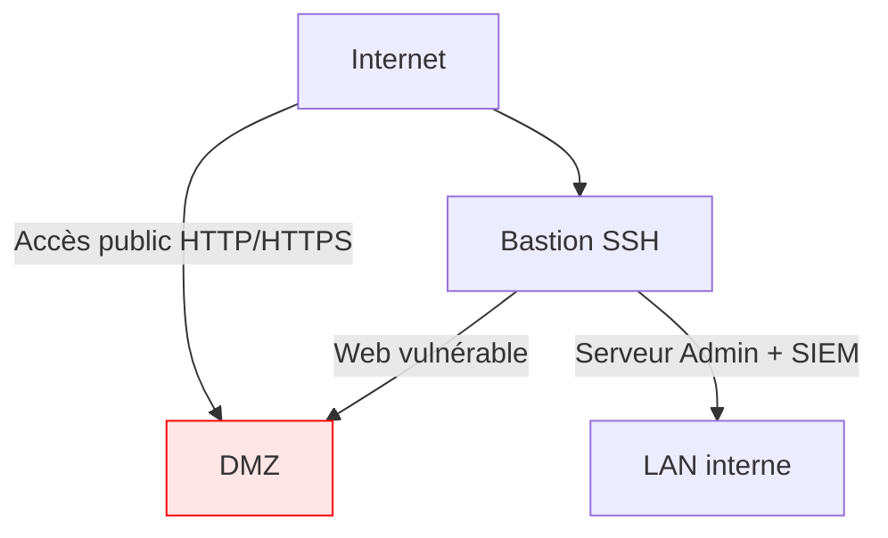

Ce lab a pour but de concevoir et déployer une infra sécurisée et segmentée sur Google Cloud Platform (GCP) en utilisant Terraform et Ansible.

Bonne lecture :)

# Composants

Voici les différentes technologies et composants du projet.

* Infrastructure
    
    * `Terraform`: outil d’Infrastructure as Code IaC, qui permet de créer, modifier et supprimer des ressources (machines, réseaux etc.) avec des fichiers de configuration texte
        
    * `Google Cloud Platform`: fournisseur cloud qui héberge les VMs
        
* Sécurité
    
    * `Ansible`: configuration et sécurisation des serveurs par rôles
        
    * `ufw/iptables`: pare-feu locaux pour les politiques de filtrage au niveau des VM (ouverture de ports si nécessaires)
        
* Réseau
    
    * Réseau VPC segmenté en trois zones
        
        * `DMZ`: hébergement d’un serveur vulnérable qui permet d’attirer les attaques externes.
            
        * `LAN interne`: regroupe les machines privées et serveurs de détection (Wazuh, Zeek). Il recoit les logs et alertes du DMZ et des autres VMs.
            
        * `Zone d’administration`: contient le bastion sécurisé SSH qui sert de point d’accès permettant d’administrer le réseau.
            
            * `Le bastion SSH` est la seule machine avec une IP publique et permet d’accéder aux seveurs d’admin du réseau.
                
            * `Le serveur admin / Admin subnet` contient aussi les machines privées uniquement accessibles via le bastion.
                
    * `Pare-feux GCP`: contrôle les flux entre les sous-réseaux
        

Voici un diagramme montrant l’architecture et les différentes étapes.



# Étape 1: Design réseau + Terraform

La première étape est de créér l’infrastructure du réseau avec Terraform. Il sera composé de :

* Un VPC (réseau virtuel principal)
    
* Trois sous-réseaux pour le `dmz`, le `LAN interne` et le `serveur admin`
    
* 3 machines virtuelles
    
    * Une pour le `bastion` SSH
        
    * Une pour le serveur vulnérable `web-dmz`
        
    * Une pour le `SIEM` à configurer plus tard
        

Commencer par mettre à jour la VM puis installer les dépendances:

```bash
sudo apt-get update && sudo apt-get install -y gnupg software-properties-common
```

Ajouter la clé CPG avec la commande suivante:

```bash
wget -O- https://apt.releases.hashicorp.com/gpg | \
gpg --dearmor | \
sudo tee /usr/share/keyrings/hashicorp-archive-keyring.gpg > /dev/null
```

Vérifier ensuite l’empreinte digitale de la clé CPG

```bash
gpg --no-default-keyring \
--keyring /usr/share/keyrings/hashicorp-archive-keyring.gpg \
--fingerprint
```

Vous obtenez l’empreinte digitale de la clé et vérifier si elle est bien signée par HashiCorp.

Ajouter ensuite le répertoire officiel de HashiCorp à votre système.

```bash
echo "deb [arch=$(dpkg --print-architecture) signed-by=/usr/share/keyrings/hashicorp-archive-keyring.gpg] https://apt.releases.hashicorp.com $(grep -oP '(?<=UBUNTU_CODENAME=).*' /etc/os-release || lsb_release -cs) main" | sudo tee /etc/apt/sources.list.d/hashicorp.list
```

Mettre à jour puis installer Terraform. Elle est déjà intégrée si vous utilisez le cloud shell de GCP.

```bash
sudo apt get update
sudo apt-get install terraform
```

Vérifier l’installation de Terraform

```bash
terraform -v
```


Voici les fichiers principaux de Terraform:

* `main.tf`: définit les ressources de l’infra (VMs, réseau, base de données etc )
    
* `variables.tf`: définit les variables utilisées dans les configurations Terraform, comme le nom, la région, la taille de la machine, ainsi que des descriptions pour chaque variable
    
* `outputs.tf`: définit les sorties ou valeurs qu’on souhaite avoir après exécution de la configuration Terraform. Il s’agit des infos comme les adresses IP ou les identifiants des ressources créées.
    
* `providers.tf`: contient la configuration du fournisseur de service cloud (GCP, AWS etc)
    
* `firewall.tf`: définit les règles de pare-feu
    

On commence par le fichier `variables.tf` en y déclarant les variables

```bash
variable "project_id" {
  description = "Project ID"
  type = string
  default = ""
}

variable "region" {
  description = "Region for deploying resources"
  type = string
  default = "us-central1"
}

variable "zone" {
  description = "Zone for deploying resources"
  type = string
  default = "us-central1-c"
}

variable "bastion_ssh_key" {
  description = "Public key for ssh bastion"
  type = string
}
```

Ensuite le fichier `main.tf`, en y déclarant l’infrastructure suivante:

* Un `VPC` (réseau virtuel principal)
    
* Trois sous-réseaux pour le `dmz`, le `LAN interne` et le `serveur admin`
    
* 3 machines virtuelles
    
    * Une pour le `bastion` SSH
        
    * Une pour le serveur vulnérable `web-dmz`
        
    * Une pour le `SIEM`
        

Dans cette configuration, le bastion est le point d’entrée unique pour accéder à toute l’infrastructure. Il y a deux manières pour s’y connecter:

* depuis la machine local avec `ssh -i ~/.ssh/bastion_key.pub`. Dans ce cas, il faut générer une paire de clé localement, qu’il faut ensuite copier au niveau cloud shell dans le dossier`~/.ssh/` ou l’assigner à une variable. Pour cela, on utilise une variable `bastion_ssh_key`, déclaré dans le fichier `variables.tf`, dont la valeur est défini dans le fichier `terraform.tfvars`.
    
    
    
    La valeur de la variable `bastion_ssh_key` sera donc lue dans le fichier `terraform.tfvars` puis la clé sera ensuite injectée dans la VM lors du déploiement au niveau du paramètre `metadata`.
    
* depuis le cloud shell de gcp avec `gcloud compute ssh NOM_DE_LA_VM --zone=ZONE`. Dans ce cas, gcloud utilise par défaut sa propre paire de clés générée automatiquement `google_compute_engine` et `google_compute_engine.pub`. Lors de la prmière connexion, une passephrase sera demandée. On peut aussi préciser la clé bastion générée localement avec l’option `--ssh-key-file`
    

Le `SIEM` dans le serveur interne sera uniquement accessible via le bastion. Pour le SIEM et le DMZ, on utilise la même paire de clé. Vu que ces deux sont accessibles uniquement via le bastion, il faudra mettre la clé privée dans le bastion plus tard.

```bash
# Provider configuration
terraform {
  required_providers {
        google = {
      source  = "hashicorp/google"
      version = "5.0"
    }
  }

  required_version = ">= 1.3"

}

  provider "google"{
    project = var.project_id
    region = var.region
    zone = var.zone
  }

# VPC Network
resource "google_compute_network" "vpc_network" {
  name = "vpc"
  auto_create_subnetworks = false

}

## Subnet LAN
resource "google_compute_subnetwork" "subnet_lan" {
  name = "lan-subnet"
  ip_cidr_range = "10.10.10.0/24"
  network = google_compute_network.vpc_network.id
  region = "us-central1"
}

## Subnet DMZ
resource "google_compute_subnetwork" "subnet_dmz" {
  name= "dmz-subnet"
  ip_cidr_range = "10.10.20.0/24"
  network = google_compute_network.vpc_network.id
  region = "us-central1"
}

## Subnet Admin
resource "google_compute_subnetwork" "subnet_admin" {
  name = "admin-subnet"
  ip_cidr_range = "10.10.30.0/28"
  network = google_compute_network.vpc_network.id
  region = "us-central1"
}


### Bastion SSH
resource "google_compute_instance" "bastion" {
  name = "bastion"
  machine_type = "e2-medium"
  zone = "us-central1-c"

  boot_disk {
    initialize_params {
      image = "ubuntu-os-cloud/ubuntu-2204-lts"
    }
  }

  metadata = {
     ssh-keys = "ubuntu=${var.bastion_ssh_key}"
 }

  network_interface {
    network = google_compute_network.vpc_network.id
    subnetwork = google_compute_subnetwork.subnet_dmz.id
    access_config {

    }
  }

  tags = ["bastion","ssh"]

}

### SIEM
resource "google_compute_instance" "siem" {
  name = "siem"
  machine_type = "e2-medium"
  zone = "us-central1-c"

  boot_disk {
    initialize_params {
      image = "ubuntu-os-cloud/ubuntu-2204-lts"
      size = 30
    }
  }

  network_interface {
    network = google_compute_network.vpc_network.id
    subnetwork = google_compute_subnetwork.subnet_admin.id
  }

  metadata = {
       ssh-keys = "ubuntu=${var.bastion_ssh_key}"
 }

  tags = ["siem","admin"]
}

### Web DMZ

resource "google_compute_instance" "dmz" {
  name = "web-dmz"
  machine_type = "e2-medium"
  zone = "us-central1-c"

  boot_disk {
    initialize_params {
      image = "ubuntu-os-cloud/ubuntu-2204-lts"
    }
  }

  network_interface {
    network = google_compute_network.vpc_network.id
    subnetwork = google_compute_subnetwork.subnet_dmz.id
    access_config {

    }
  }

  metadata = {
     ssh-keys = "ubuntu=${var.bastion_ssh_key}"
  }

  tags = ["dmz"]
}
```

On va ensuite initialiser et vérifier que la configuration des fichiers Terraform est correcte. Des erreurs de syntaxe peuvent apparaître avec ces commandes.

```bash
terraform init
terraform validate
```

Exécuter aussi la commande suivante. Elle permet de visualiser le plan d’exécution dans Terraform. Elle génère un apercu des actions qui seront effectuées, comme la création, la modification ou la suppression des ressources.

```bash
terraform plan
```

Appliquer le tout avec la commande suivante pour créer l’infrastructure.

```bash
terraform apply
```

On peut ensuite vérifier les instances VM et les sous réseaux créés avec les commandes suivantes:

```bash
gcloud compute instances list
gcloud compute networks subnets list
```


ll faut maintenant gérer les règles de pare-feu dans le fichier `firewall.tf`. Voici les différentes règles ajoutées:

1. allow-ssh-bastion
    
    Cette règle autorise la connexion SSH depuis des adresses précises. Ici depuis le pc local, puis le cloud shell. Sans la règle, la connexion est bloqué sur le port 22 avant d’arriver à la VM
    
2. allow-http-https-dmz
    
    Cette règle permet à tout Internet d’accéder au serveur web vulnérable, vu qu’elle a une IP publique
    
3. allow-internal-trafic
    
    Cette règle autorise le trafic interne entre sous-réseaux (LAN, DMZ, Admin)
    

```bash
# SSH to the bastion
resource "google_compute_firewall" "allo_ssh_bastion" {
  name = "allow-ssh-bastion"
  network = google_compute_network.vpc_network.name

  allow {
    protocol = "tcp"
    ports = ["22"]
  }

  source_ranges = ["IP_PUBLIC_PC_LOCAL/32"]
  target_tags = ["ssh","bastion"]
  description = "Allow SSH access from the Bastion"
}

# HTTP and HTTPS to DMZ
resource "google_compute_firewall" "allow_http_dmz" {
  name = "allow-http-https-dmz"
  network = google_compute_network.vpc_network.name

  allow {
    protocol = "tcp"
    ports = ["80","443"]
  }

  source_ranges = ["0.0.0.0/0"]
  target_tags = ["dmz"]
}

# Internal traffic
resource "google_compute_firewall" "allow_internal" {
  name = "allow-internal-trafic"
  network = google_compute_network.vpc_network.name

  allow {
    protocol = "tcp"
    ports = ["0-65535"]
  }

  allow {
   protocol = "udp"
   ports = ["0-65535"]
  }

  allow {
    protocol = "icmp"
  }

  source_ranges = ["10.10.0.0/16"]
}
```

Revalider le tout avec les commandes suivantes:

```bash
terraform validate
terraform plan
terraform apply
```

Les règles ont bien été créées.


## Connexion sur les VMs

On essaie maintenant de se connecter sur les différentes VMS en commencant par le bastion. On arrive ensuite à bien se connecter avec `gcloud compute ssh` depuis le cloud shell de GCP,puis avec `ssh -i` en local.


Une fois connecté au bastion, on vérifie dans `~/.ssh/authorized_keys`, on a bien la clé publique `bastion_ssh_key` insérée dans le fichier `main.tf` au moment de la création des VMs. On peut maitenant y copier la clé privée depuis notre poste sur le bastion afin de se connecter aux autres VMs qui ont déjà la clé pubique. La clé privée est copiée dans `~/.ssh/bastion_key`. On se connecte par la suite au SIEM avec la commande `ssh -i ~/.ssh/bastion_key ubuntu@10.10.30.2`.


Pareil pour le dmz, avec la commande `ssh -i ~/.ssh/bastion_key ubuntu@10.10.20.2`.


# Étape 2: Configuration avec Ansible (par rôles)

La deuxième partie consiste à automatiser la configuration des serveurs créés plus haut par avec Ansible. Chaque serveur (bastion, dmz et SIEM) aura son propre rôle Ansible, ce qui permet de mieux séparer les responsabilités:

* Rôle bastion: sécurisation du SSH
    
* Rôle dmz: installation du serveur web vulnérable
    
* Rôle siem: déploiement des outils de détection.
    

Cette approche permet de faciliter la réutilisation et le déploiement des configurations.

Pour la suite, Ansible sera exécuté sur le Cloud Shell qui est ici notre machine de contrôle (ayant accès SSH à toutes les VMs). Le DMZ et le bastion ayant une ip publique, Cloud Shell peut s’y connecter directement. Mais la vm siem n’a qu’une IP privée et donc Cloud Shell ne peut pas s’y connecter directement. Dans ce cas on utilisera la méthode du `ProxyJump`, qui consiste à accéder d’abord au bastion depuis le Cloud Shell, puis ensuite au siem.

Avant d’utiliser Ansible, il faut s’assurerque c’est installé sur la machine:

```bash
sudo apt update
sudo apt install ansible -y
```

Verifiez ensuite la version avec la commande suivante:

```bash
ansible --version
ansible-playbook --version
```


## Structure Ansible

Voici la structure Ansible du projet:

```bash
ansible/
├── ansible.cfg
├── inventory.ini
├── site.yml
│
├── playbooks/
│   ├── bastion.yml
│   ├── dmz.yml
│   └── siem.yml
│
└── roles/
    ├── bastion/
    │   ├── tasks/main.yml
    │   ├── handlers/main.yml
    │   ├── templates/
    │   └── files/
    │
    ├── dmz/
    │   ├── tasks/main.yml
    │   ├── handlers/main.yml
    │   ├── templates/
    │   └── files/
    │
    └── siem/
        ├── tasks/main.yml
        ├── handlers/main.yml
        ├── templates/
        └── files/
```

* `ansible.cfg`: fichier de configuration principale d’Ansible.
    
* `inventory.ini`: fichier listant les hôtes et les groupes (il agit comme un inventaire)
    
* `site.yml:` fichier de playbook principal qui sert à gérer l’exécution de plusieurs rôles ou tâches sur les hôtes
    
* `playbook/`: dossier contenant les playbooks à exécuter. Un playbook est un fichier contenant une série d’instructions à exécuter sur des hôtes. On peut soit tuliser les playbooks individuels en les lancant séparément ou en faisant le tout directement avec `site.yml`.
    
* `roles/`: dossiers de rôles Ansible pour organiser les tâches et les rendre en composants réutilisables (installation de paquets, modification DNS, etc.).
    
    * `tasks/main.yml` contient toutes les tâches Ansible que l’on veut exécuter pour le rôle.
        
    * `handlers/main.yml` : contient des actions qui doivent être exécutées en réponse à des changements par des tâches dans un rôle. Par exemple, si une tâche dans `tasks/main.yml` modifie un fichier de config, un handler peut être déclenché pour redémarrer le service associé pour que les modifications prennent effet.
        
    * `templates/` et `files/` sont facultatifs. On les utilise lorsqu’on veut déployer des configuration précises sur les VMs
        

## Ansible.cfg

Voici le fichier `ansible.cfg`

```bash
[defaults]
inventory = ./inventory.ini
remote_user = ubuntu
host_key_checking = False
retry_files_enabled = False
roles_path = ./roles

stdout_callback = yaml
bin_ansible_callbacks = True
```

La variable `remote_user` représente l’utilisateur utilisé pour les connexions SSH selon l’image utilisée lors de la création de la VM.

## Inventory.ini

Le fichier `inventory.ini`

```bash
[bastion]
bastion ansible_host=IP_PRIVE_BASTION ansible_user=ubuntu 

[dmz]
web-dmz ansible_host=IP_PRIVE_DMZ ansible_user=ubuntu

[siem]
siem ansible_host=IP_PRIVE_SIEM ansible_user=ubuntu

[all:vars]
ansible_ssh_private_key_file=~/.ssh/bastion_key
```

* La variable `ansible_host` représente l’adresse IP publique ou privée que Ansible doit utiliser pour se connecter.
    
* On met l’adresse IP publique du bastion car c’est le point d’entrée accessible depuis l’extérieur
    
* Pour le DMZ et le SIEM, on utilise les IP privées car ces machines ne sont accessibles qu’à travers le Bastion.
    
* À noter aussi la variable `ansible_ssh_private_key_file` qui permet de spécifier la clé privée à utiliser pour se connecter via SSH. Par défaut, Ansible utilise la clé privée générée par Cloud Shell `~/.ssh/google_compute_engine.pub`. Pour cela qu’il faut spécifier le chemin de la clé privée à utiliser correspondante à la clé publique présente au niveau du bastion.
    

On vérifie ensuite la connexion SSH vers les machines spécifiées dans le fichier `inventory.ini`, avant d’écrire les rôles. La commande est `ansible MACHINE_NAME -m ping`. Elle permet à Ansible de se connecter à chaque machine via SSH pour vérifier la connectivité.

Pour le dmz:


Pour le siem:


Ici, on exécute Ansible depuis le bastion et non depuis le Cloud Shell car il ets el point d’accès unique au VPC. Il peut joindre les autres machines directement via leurs IP privées. Avec le cloud Shell il aurait fallu utiliser un ProxyJump, cest à dire se connecter d’abord au bastion, puis ensuite aux machines.

## Site.yml

Pour le fichier `site.yml`, on y définit les rôles et les tâches qui doivent être exécutés.

* la variable `name` définit la tâche ou l’ensemble de tâches
    
* la variable `hosts` spécifie l’hpote sur lequel la tâche sera exécuté
    
* la variable `roles` indique le rôle qui doit être appliqué à l’hôte désigné
    

```bash
---
- name: Configure BASTION
  hosts: bastion
  become: yes
  roles:
    - bastion

- name: Configure DMZ
  hosts: dmz
  become: yes
  roles:
    - dmz

- name: Configure SIEM
  hosts: siem
  become: yes
  roles:
    - siem
```

On lance ensuite le tout avec la commande suivante:

```bash
ansible-playbook -i inventory.ini site.yml
```

## Roles

On poursuit avec le rôle `bastion`. Il servira à sécuriser le serveur bastion, qui sert de point d’accès au réseau. On cible ici, le SSH (la clé publique et la désactivation du root), le pare-feu local puis un outil de protection de base tel que fail2ban.

Le fichier `/roles/bastion/tasks/main.yml` contiendra les tâches suivantes:

1. Mettre à jour des paquets
    
2. Sécuriser SSH
    
    1. Désactiver l’accès root via SSH
        
3. Gérer le pare feu local
    
    1. Autoriser uniquement le trafic SSH entrant.
        
    2. Activer le pare-feu avec une politique par défaut de refus.
        
4. Fail2ban
    
    1. Installer Fail2ban
        
    2. Configuer Fail2ban pour surveiller les logs SSH
        

```bash
---
# Upgrade packages
- name: Update and updgrade packages
  ansible.builtin.apt:
    update_cache: yes
    upgrade: dist
  become: yes


# SSH
- name: Disabled root login via SSH
  ansible.builtin.lineinfile:
    path: /etc/ssh/sshd_config
    regexp: '^PermitRootLogin'
    line: 'PermitRootLogin no'
    state: present
    validate: '/usr/sbin/sshd -t %s'
  notify: Restart SSH Service
  become: yes

# UFW
- name: Verify UFW is installed
  ansible.builtin.apt:
    name: ufw
    state: present
  become: yes

- name: Allow SSH through UFW
  ansible.builtin.ufw:
    rule: allow
    name: OpenSSH

- name: Enable UFW with deny policy (per default)
  ansible.builtin.ufw:
    state: enabled
    default: deny

# Fail2ban
- name: Install Fail2ban
  ansible.builtin.apt:
     name: fail2ban
     state: present
  become: yes

- name: Start Fail2ban
  ansible.builtin.service:
    name: fail2ban
    state : started
    enabled: true
```

Toujours au niveau des rôles du bastion, on met le fichier `/roles/bastion/handlers/main.yml`. Le handler `Restart SSH Service` est appelé dans `/roles/bastion/tasks/main.yml` au niveau de l’option `notify:`

```bash
---
- name: Restart SSH Service
  ansible.builtin.service:
    name: sshd
    state: restarted
    enabled: true
```

On passe au rôle du `dmz` . Dans le fichier `/roles/dmz/tasks/main.yml`, on a les tâches suivantes:

1. Mettre à jour les paquets
    
2. Installer des services web
    
    1. Installer un serveur web Nginx vulnérable
        
    2. Ouvrir les ports HTTP et HTTPS
        
3. Gérer le pare feu
    
    1. Bloquer le trafic entrant par défaut
        
    2. Autoriser uniquement les services HTTP, HTTPS et SSH (pour le bastion)
        

```bash
---
# Upgrade packages
- name: Update and upgrade packages
  ansible.builtin.apt:
    update_cache: yes
    upgrade: dist
  become: yes


# Web services
- name: Nginx install
  ansible.builtin.apt:
    name: nginx
    state: latest
    update_cache: yes
  become: yes
  notify: Restart nginx

- name: Nginx service started and enabled
  ansible.builtin.systemd:
    name: nginx
    state: started
    enabled: true
  become: yes


# Pare feu
- name: Verify UFW is installed
  ansible.builtin.apt:
    name: ufw
    state: present
  become: yes

# On définit les règles avant d'actvier UFW pour éviter un lockouttt

# Allow HTTP
- name: Allow HTTP port
  ansible.builtin.ufw:
    rule: allow
    port: 80
    proto: tcp
  become: yes

# Allow HTTPS
- name: Allow HTTPS port
  ansible.builtin.ufw:
    rule: allow
    port: 443
    proto: tcp
  become: yes

# SSH only from Bastion
- name: Allow SSH from Bastion only
  ansible.builtin.ufw:
    rule: allow
    port: 22
    proto: tcp
    src: 10.10.20.2
  become: yes

#  UFW policies
- name: Deny incoming trafic UFW
  ansible.builtin.ufw:
    direction: incoming
    policy: deny
  become: yes

- name: Allow outgoing trafic UFW
  ansible.builtin.ufw:
    direction: outgoing
    policy: allow
  become: yes

# Activate UFW
- name: Enable UFW
  ansible.builtin.ufw:
    state: enabled
  become: yes
```

On a ensuite le fichier `/handlers/main.yml`, qui redémarre le service Nginx à chaque modification de celui-ci.

```bash
---
- name: Restart nginx
  ansible.builtin.service:
    name: nginx
    state: restarted
    enabled: true
```

On passe ensuite au rôle du SIEM, pour la détection et l’analyse de sécurité. Dans le fichier `/roles/siem/tasks/main.yml` on a les tâches suivantes:

1. Mettre à jour les paquets
    
2. Installer les dépendances et outils essentiels comme curl, vim, wget etc.
    
3. Sécuriser SSH
    
    1. Désactiver l’accès root via SSH
        
4. Installer les outils SIEM
    
    1. Installer Zeek
        
    2. Installer Suricata
        
5. Gérer le pare feu
    
    1. Blocage par défaut du trafic entrant.
        
    2. Autorisation totale du trafic sortant.
        

```bash
---
# Upgrade packages
- name: Update and upgrade packages
  ansible.builtin.apt:
    update_cache: yes
    upgrade: dist
  become: yes

# SSH
- name: Disabled root login via SSH
  ansible.builtin.lineinfile:
    path: /etc/ssh/sshd_config
    regexp: '^PermitRootLogin'
    line: 'PermitRootLogin no'
    state: present
    validate: '/usr/sbin/sshd -t %s'
  notify: Restart SSH Service
  become: yes

- name: Allow SSH from Bastion only
  ansible.builtin.ufw:
    rule: allow
    port: 22
    proto: tcp
    src: 10.10.20.2
  become: yes


# Install Zeek and Suricata
- name: Install Zeek
  ansible.builtin.apt:
    name: zeek
    state: present
  notify: Restart Zeek
  become: yes

- name: Install Suricata
  ansible.builtin.apt:
    name: suricata
    state: present
  notify: Restart Suricata
  become: yes

# Pare feu
- name: Verify UFW is installed
  ansible.builtin.apt:
    name: ufw
    state: present
  become: yes


#  UFW policies
- name: Deny incoming trafic UFW
  ansible.builtin.ufw:
    direction: incoming
    policy: deny
  become: yes

- name: Allow outgoing trafic UFW
  ansible.builtin.ufw:
    direction: outgoing
    policy: allow
  become: yes

# Activate UFW
- name: Enable UFW
  ansible.builtin.ufw:
    state: enabled
  become: yes
```

Au niveau de `/roles/siem/handlers/main.yml`, il suffira de rédemarrer les services après modification.

```bash
---
- name: Restart SSH Service
  ansible.builtin.service:
    name: sshd
    state: restarted
    enabled: true

- name: Restart Zeek
  ansible.builtin.service:
    name: zeek
    state: restarted
    enabled: true

- name: Restart Suricata
  ansible.builtin.service:
    name: suricata
    state: restarted
    enabled: true
```

Une fois que les rôles sont définis, on peut tester le déploiement avec Ansible pour s’assurer que le tout fonctionne. On teste un rôle à la fois avec la commande suivante. L’option `--limit` permet d’exécuter le playbook uniquement sur l’hôte spécifié.

```bash
ansible-playbook -i inventory.ini site.yml --limit bastion
ansible-playbook -i inventory.ini site.yml --limit dmz
ansible-playbook -i inventory.ini site.yml --limit siem
```

Ce petit lab permet de mettre en place une infra segmentée dans le cloud en combinant Terraform pour le déploiment et Ansible pour la configuration.

# Documentation

* *Install terraform | terraform | hashicorp developer*. (n.d.). Install Terraform | Terraform | HashiCorp Developer. Retrieved October 25, 2025, from [https://developer.hashicorp.com/terraform/tutorials/gcp-get-started/install-cli](https://developer.hashicorp.com/terraform/tutorials/gcp-get-started/install-cli)
    
* *Terraform files—How to structure terraform project*. (n.d.). Spacelift. Retrieved October 25, 2025, from [https://spacelift.io/blog/\[slug\]](https://spacelift.io/blog/%5Bslug%5D)
    
* *Ansible configuration settings—Ansible community documentation*. (n.d.). Retrieved October 26, 2025, from [https://docs.ansible.com/ansible/latest/reference\_appendices/config.html](https://docs.ansible.com/ansible/latest/reference_appendices/config.html)